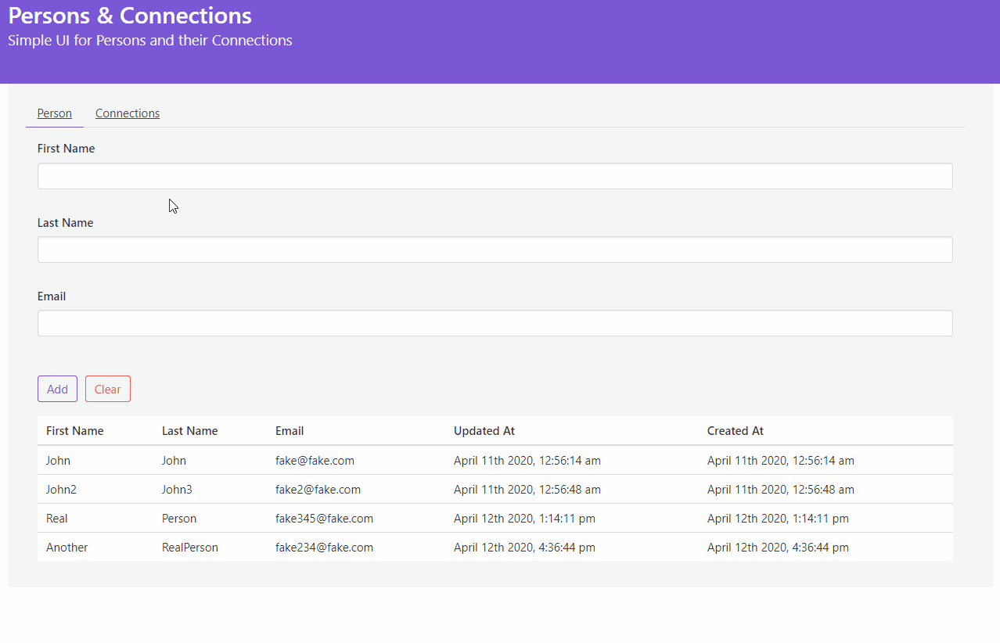
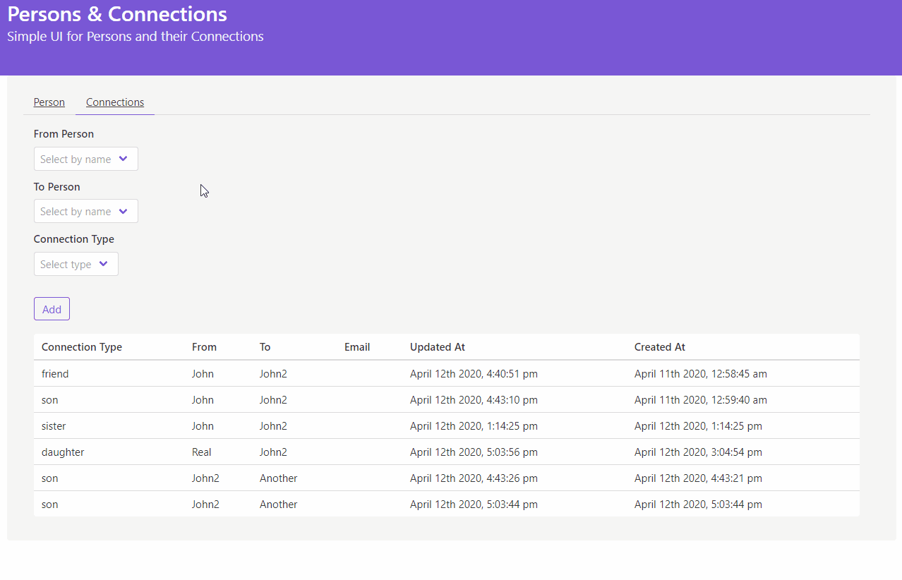

# Connections Web Client Demo

Client for [this API BE](https://github.com/haskone/dummy_connections_be) that does the following:

Person:


Connection:


## Tech

- Vue, Vuex
- Buefy
- moment, axios

## Project setup
```
npm install
```

### Compiles and hot-reloads for development
```
npm run serve
```

### Compiles and minifies for production
```
npm run build
```

### Lints and fixes files
```
npm run lint
```
